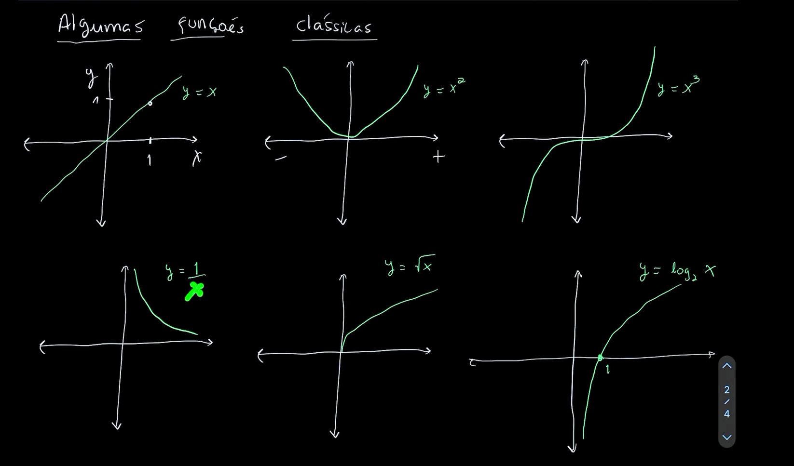

## Matemática para Dados

##### Fontes: Asimov Academy, Gemini e ChatGPT

### Cálculo 

O que são funções?

Simplificando, é uma relação matemática entre duas coisas.

Exemplo de funções:

$$y = 2x+ 3$$

Como  faria um gráfico disso? Vamos supor que X tem valores de 0 a 3 e voce teria que que substituir o x da formula pelos valores do x até chegar nos 4 resultados exemplo: 2 \* 0,  2\*1, 2\*2 e 2\*3 

Colocar foto aqui

<br>




Y sempre terá o mesmo valor de X


Todo valor de Y será x2 . Sempre sendo o dobro.

### Funções com múltiplas dependências 


* * *

<br>

### Limites 

O **limite** não quer saber o que acontece no ponto exato, mas sim **para onde a função está se aproximando** quando chegamos bem perto desse ponto. Literalmente testar os limites.

## Analogia do GPS e do buraco na pista

Imagine que você está dirigindo em uma pista reta em direção ao **km 1**:

- Ponto exato $$x = 1:$$ Existe um buraco na pista. Se você colocar o pneu exatamente em $$x = 1$$, você cai (a

função não existe: f(1) é indefinida).

- O Limite (x → 1): É o GPS observando o caminho. Ele vê você no quilômetro 0{,}999 (altura 1) e no

quilômetro 1{,}001 (altura 1). O GPS prevê com precisão: "a pista te leva à altura 1".

## Exemplo de análise exploratória 

Dada a função: $$f(x) = (x - 1) / (x - 1)$$  


**Simplificação algébrica:** Qualquer número (diferente de zero) dividido por ele mesmo é $$1$$  

* * *

<br>

### Derivadas

A derivada é a taxa de variação **da função como um todo**, mas sempre **no ponto que você está analisando**.

Ela não “pega só a parte da trigonometria” ou só um pedaço específico da expressão, ela vale para a função inteira, mas cada parte (seno, cosseno, polinômio, constante etc.) contribui na conta de acordo com suas próprias regras de derivação.

> Comparação entre função e derivada: Função determina todo o caminho que a variável Y está percorrendo na variável X por exemplo. E a Derivada descreve como a variável Y está se alterando em comparação com X  

## Analogia: A Viagem de Carro

Imagine que você viajou 100 km em 1h:

- **Velocidade Média:** 100km (cálculo global do percurso).
- **Derivada (Velocidade Instantânea):** O valor exato que o velocímetro indicava às $10h32min15s$. Em um instante você podia estar a $80\\text{ km/h}$, e em outro a $120\\text{ km/h}$.

## Interpretação Geométrica

No gráfico de uma função, a derivada em um ponto representa a **inclinação (declive) da reta tangente** à curva naquele ponto.

```
      y |         . (topo: derivada = 0 -> inclinação nula)
        |       .   .
        |     .       . (caindo: derivada < 0 -> tendência negativa)
        |   . (subindo: derivada > 0 -> tendência positiva)
        +------------------- x

```

- **Derivada > 0:** O gráfico está subindo (função crescendo).
- **Derivada < 0:** O gráfico está caindo (função decrescendo).
- **Derivada = 0:** Ponto crítico (o topo de um morro ou o fundo de um vale).

## Derivadas em Ciência de Dados e IA

A Ciência de Dados consiste em construir **modelos preditivos** que minimizam erros. A derivada é a engrenagem principal para fazer o modelo aprender sozinho.

### 1\. Minimização do Erro (Função de Custo / Loss Function)

Todo algoritmo de IA (como Regressão Linear, Redes Neurais e XGBoost) possui uma **Função de Custo** que calcula o tamanho do erro cometido pelas previsões.

- O objetivo da máquina é encontrar o ponto onde o erro seja o **menor possível** (o fundo do vale).
- Como o fundo do vale ocorre quando a **derivada é igual a zero**, o algoritmo usa a derivada para saber quando atingiu o erro mínimo.

### 2\. O Algoritmo de Gradiente Descendente (Gradient Descent)

Se um modelo de IA está errando, ele precisa ajustar seus parâmetros. Mas em qual direção ajustar?

- A derivada aponta para onde a função de erro **cresce**.
- Se caminharmos na **direção oposta à derivada**, estamos reduzindo o erro.
- **Analogia da Névoa na Montanha:** Se você está no topo de um morro coberto por uma névoa densa e quer chegar ao fundo do vale, você tateia o chão com os pés para sentir a inclinação e dá um passo na direção que desce mais rápido. Essa "sensação de inclinação sob os pés" é a derivada.

### 3\. Backpropagation em Redes Neurais

O treinamento de redes neurais profundas utiliza a **Regra da Cadeia** (uma técnica de derivação) para calcular como cada neurônio individual contribuiu para o erro final da rede, ajustando os pesos do último neurônio até o primeiro.

## Exemplos Práticos em Ciência de Dados

### Exemplo 1: Regressão Linear Simples

Suponha que você quer prever o **Preço de um Imóvel (y)** com base na **Área em m2 (x)**.

1. A equação da reta é $$y = w  \* x + b.$$
2. O algoritmo define uma função de erro (Erro Quadrático Médio - MSE):

$$E(w) = (Valor Real - (w \* x + b))2$$
3. Para descobrir o melhor valor do peso $$w$$, calculamos a derivada do erro em relação a w:


4. O algoritmo atualiza o peso $$w$$ a cada passo:


### Exemplo 2: Código em Python (Simulando o ajuste por Derivada)

 Python utilizando derivadas para achar o ponto mínimo da função $$f(x) = x2 - 4x + 5:$$

Python

```
# Função: f(x) = x2 - 4x + 5
# Sua derivada é: f'(x) = 2x - 4

x = 10.0  # Chute inicial arbitrário
learning_rate = 0.1  # Passo da atualização

print("--- Iniciando o Gradiente Descendente ---")
for passo in range(10):
    # Calculando a derivada no ponto x atual
    derivada = 2 * x - 4

    # Atualizando o valor de x na direção oposta à derivada
    x = x - learning_rate * derivada

    print(f"Passo {passo + 1}: x = {x:.4f} | Derivada = {derivada:.4f}")

print(f"\nValor final ideal de x: {x:.2f} (onde a derivada é próxima de 0)")
```


### Derivadas para problemas de otimização

Otimizar significa encontrar o valor da variável x que produz o menor custo/erro possível na função.


O Papel da Derivada A derivada mede a inclinação local da curva de custo e indica para qual direção ajustar o parâmetro: Derivada < 0 (Negativa): O custo diminui se você AUMENTAR o valor de x1.  Derivada > 0 (Positiva): O custo diminui se você DIMINUIR o valor de x1. Derivada = 0 (Nula): Ponto crítico de parada. Você atingiu o Mínimo Local/Global.

<br>

### **Derivada parcial**

É a derivada de uma função com várias variáveis, **alterando apenas uma variável enquanto mantém as outras constantes**.

Exemplo:

$$f(x,y)=x2+3y$$

- Em relação a **x**: y fica constante → $$∂x/∂f​=2x$$
- Em relação a **y**: x fica constante → $$∂y/∂f​=3$$

**Resumindo:** mede **como a função muda em relação a uma variável específica**, ignorando momentaneamente as outras.